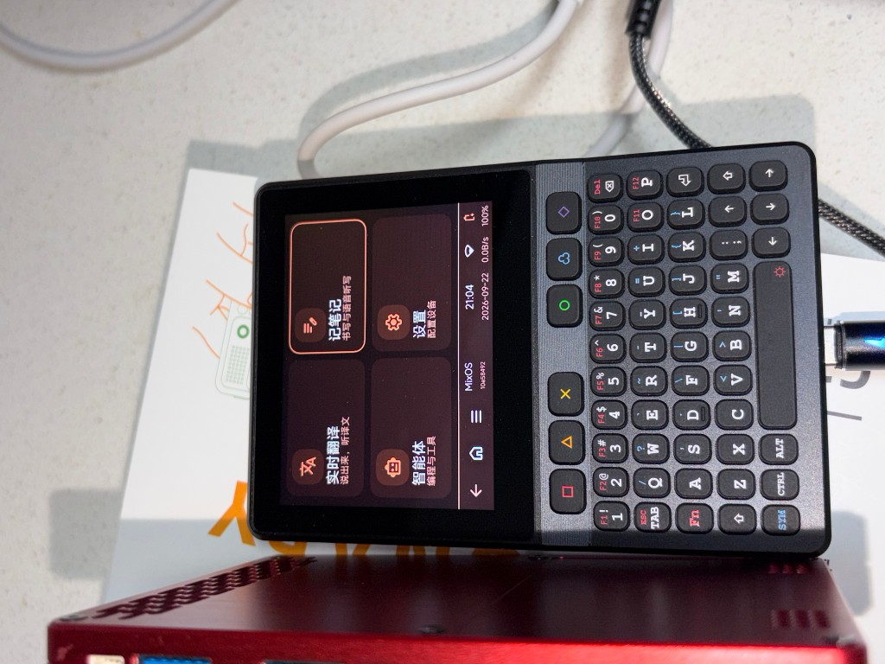
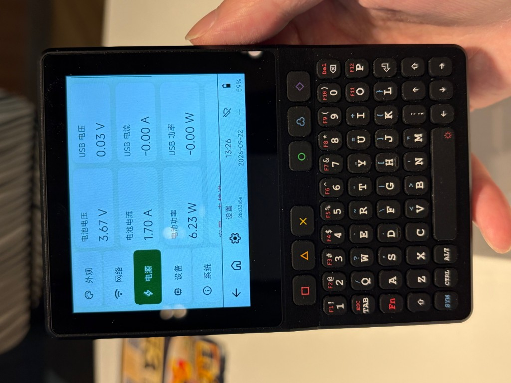
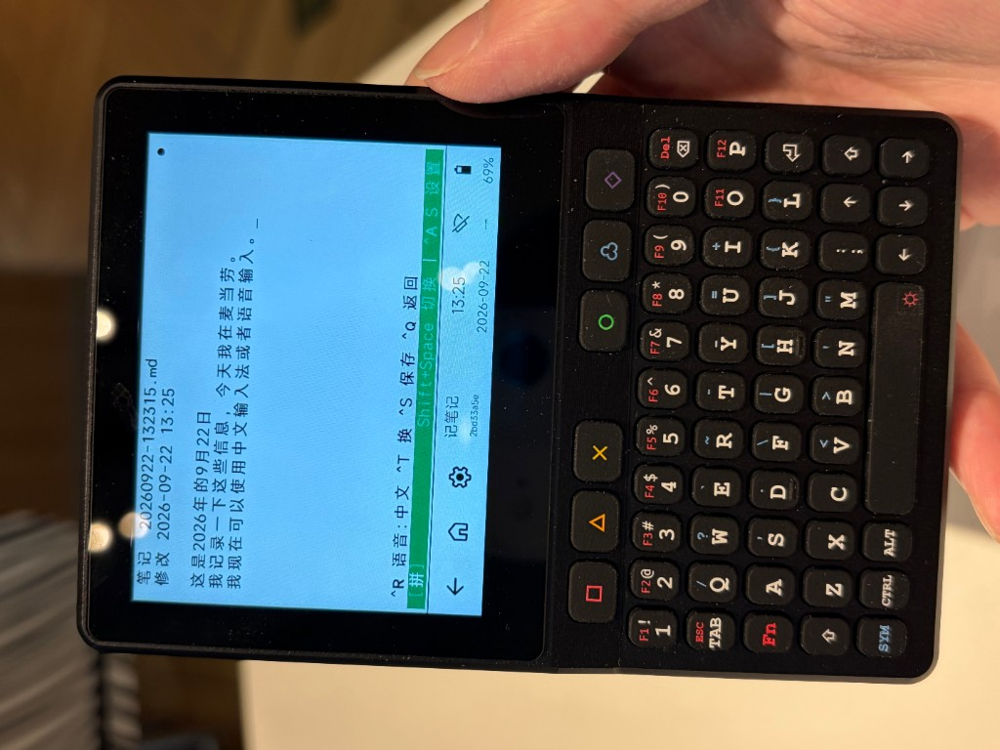

# MixOS

MixOS 是面向 TypixDeck 掌上设备的固件与 Linux 服务项目，将屏幕、触控、实体键盘、音频和 Linux 终端整合为统一的设备界面。它运行在现有 Linux 系统之上，不是独立的 Linux 发行版。

## 实机界面

| 首页 | 电源 | 笔记 |
| --- | --- | --- |
|  |  |  |

## 功能

- **设备界面**：中文／英文、多主题、触控导航，以及电池、电源和传感器状态显示。
- **Linux 终端**：通过 USB CDC 连接主机，支持实体键盘输入、中文字符和终端应用。
- **应用入口**：提供笔记、翻译和 Linux 终端；语音与翻译需另行配置后端，Agent 功能目前为预留入口。
- **音频**：通过 ESP32-S3 提供 USB 音频、麦克风与扬声器接口。
- **固件更新**：支持 ESP32-S3 A/B 应用更新、镜像校验、试运行确认和持久化任务记录，正常更新无需按 BOOT。

## 系统组成

- **Linux 主机（CM4／CM5）**：运行 `mixosd`、终端会话和应用后端。
- **ESP32-S3**：负责显示、触控、设备状态、USB 通信与音频。
- **STM32 键盘控制器**：扫描按键，通过 I²C 向 ESP32-S3 提供输入事件。

本项目针对特定硬件设计。使用其他板卡时，需要核对引脚、外设、分区和 USB 身份；A/B 更新也不能替代完全失去响应时所需的独立复位通道。

## 项目结构

- `firmware/`：ESP32-S3 与 STM32 键盘固件。
- `linux/`：主机服务、终端应用与系统集成配置。
- `protocol/`：USB、键盘与更新协议。
- `tools/`：构建、部署、维护工具及离线界面预览。
- `tests/`：主机侧测试与固件测试桩。
- `docs/`：开发、使用和硬件说明。

## 开始使用

从[文档导航](docs/README.md)进入，或直接阅读：

- [构建指南](docs/BUILD.md)与[开发环境](docs/HOST_TOOLS.md)
- [Linux 服务配置](docs/linux.md)与[应用和 AI 后端](docs/AI_DECK.md)
- [ESP32 固件更新](docs/ESP_OTA.md)与[测试指南](docs/TESTING.md)

界面预览可直接打开 [`tools/preview/index.html`](tools/preview/index.html)，无需连接设备。预览中的数据是模拟数据。

## 许可证

项目许可证见 [LICENSE](LICENSE)。第三方组件、键盘固件与字体保留各自许可证；来源与使用要求见[来源说明](docs/SOURCES.md)。
