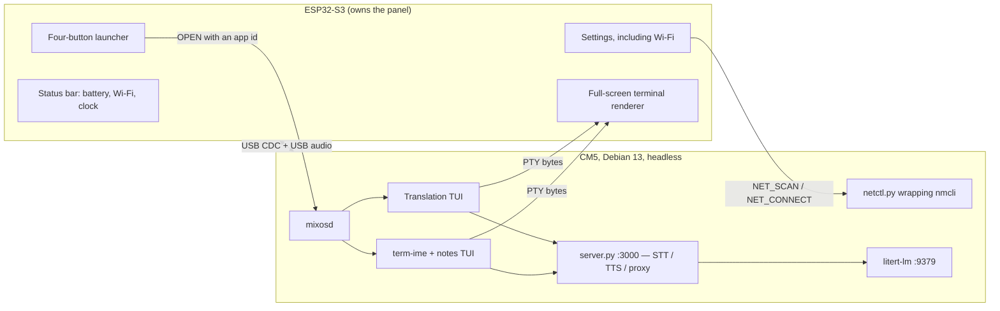

# The AI deck

MixOS turns this device into a handheld whose screen is never handed away. The
ESP32-S3 owns the panel permanently and draws its own interface; the Compute
Module 5 beside it is a headless USB peripheral that runs the heavy work and
sends back nothing but terminal characters.

Four buttons, and one of them is honest about being empty:

| Button | What it starts | Where it runs |
| --- | --- | --- |
| Live translation | `translator_tui.py` | CM5, drawn as text on the ESP32 |
| Notes | `term-ime` wrapping `notes_tui.py` | CM5, drawn as text on the ESP32 |
| Agent | nothing | a placeholder screen on the ESP32 that says so |
| Settings | the ESP32's own settings pages | ESP32 only |



## What crosses the USB link, and what cannot

The link carries frames, never command strings. A launcher button sends `OPEN`
with a one-byte application identifier; the host maps that identifier through a
fixed table in `linux/mixosd.py` to an absolute program and a fixed argument
vector. There is no path by which a name, a fragment of a path, or anything a
user typed becomes part of a command line. The allow-list is
`shell`, `translate`, `notes` and `agent`.

Wi-Fi works the same way. The device asks (`NET_SCAN`, `NET_CONNECT`,
`NET_FORGET` on channel 6) and the host answers through `linux/netctl.py`, which
invokes `nmcli` as an explicit argument vector. A passphrase is length-prefixed
in one frame, is never logged, and never appears in the process table because
the request travels on the helper's standard input rather than its arguments.

On the device the passphrase lives in exactly one buffer in `mix_ui.c`, becomes
exactly one request, and is erased on the tick after `main.c` has read it. The
protocol is written down in [protocol/USB_V1.md](../protocol/USB_V1.md).

## Terminal rendering

`mix_terminal.c` is a real VT parser, not a line printer: alternate screen
(`1049`/`47`/`1047`), `IL`/`DL`/`ICH`/`DCH`/`ECH`/`SU`/`SD`/`REP`, the 256-colour
and 24-bit SGR extensions, and cursor-position and device-attribute replies that
travel back to the host as ordinary input. FTXUI, which term-ime uses, and
essentially every modern TUI depend on those; without them the screen is
confetti.

Two cell sizes are offered, both inside the parser's 80×28 buffer so switching
costs no memory:

| Preset | Grid | Cell | Glyph size |
| --- | --- | --- | --- |
| compact | 80 × 28 | 12 × 24 px | 20 px |
| large (default) | 64 × 22 | 16 × 32 px | 26 px |

The panel is 3.2 inches. The large preset is the default because the compact one
is, on this hardware, a demonstration rather than something to read. Changing the
size clears the grid and scrollback: every stored coordinate becomes wrong, and a
blank redraw is honest where a guessed reflow is not.

## The four interfaces

Three of the four buttons start a program on the CM5; Settings never leaves the
ESP32. The programs live in `linux/apps/` and share a small toolkit rather than
each solving the same problems differently.

| File | What it is |
| --- | --- |
| `linux/apps/tui.py` | The toolkit: a double-buffered cell grid, CJK-aware wrapping and truncation, and a keyboard decoder |
| `linux/apps/audio.py` | Recording and playback on the ESP32's USB audio card |
| `linux/apps/backend.py` | Clients for the two local services |
| `linux/apps/translator/app.py` | Live translation |
| `linux/apps/notes/app.py`, `notes/store.py` | The notes editor and where notes are kept |
| `linux/launchers/{translate,notes,agent}` | One executable per button, taking no arguments |

### Why the toolkit and not curses

The screen is not a generic terminal; it is `mix_terminal.c`, a parser this
project owns. curses would drive it from a compiled terminfo description and
emit whatever that description claims. Writing the escapes directly means every
sequence sent is one the firmware demonstrably implements. Only changed cells
are sent, because the USB link is credit-limited: a full 64×22 repaint is about
1.4 kB before escapes, and sixty of those a second would starve it.

Two rules the toolkit keeps. A double-width character occupies two cells, because
Chinese is the normal case here and a renderer that counts characters instead of
columns tears the layout apart on the first 汉字. And the screen is restored on
every exit path, because a program that dies leaving the alternate screen active
makes the device look broken.

A third rule the interfaces have to keep themselves: measure a line of key hints
before drawing it. `truncate()` will happily end a line mid-word, and the
translator's hints were a single 70-cell string on a 64-cell screen — so the line
stopped inside `Esc 中止` and `Q 退出` was never drawn at all, leaving no way to
find out how to close the interface. They are now a list, joined while they fit
and shed from the least useful end, which also means the wider geometry preset
gets the hints the narrow one cannot afford.

The grid size is asked of the terminal rather than read from `MIXOS_ROWS`. Under
`mixosd` the two agree; under `term-ime` they do not, because the input method
keeps the bottom row for its candidate bar and gives its child one row less.

Asking is only right if the answer is. Until 2026-09-14 it was not: `Pty::spawn`
hands `forkpty` a literal 24×80 and the only call that corrects it runs on
`SIGWINCH`, which never arrives on a screen that cannot be resized. The editor
therefore measured 24 rows and 80 columns on a 22×64 device and drew for a
terminal that did not exist. `tools/stage_ime.py` now carries a fix; see
[Typing Chinese](#typing-chinese).

### Recording and playing back

The microphone and speaker are on the ESP32, and Linux sees them as an ordinary
USB audio card. Recording goes through `arecord` and playback through `aplay`
rather than a Python audio library: `sounddevice` needs PortAudio and a compiled
wheel, the interfaces should keep running on the system `python3` with nothing
installed, and a recording stopped by a keypress is a subprocess that can simply
be killed.

The card is addressed as `plughw:CARD=UACCDC,DEV=0` — by name because card
numbers are assigned in probe order and move when an HDMI monitor appears, and
`plughw` rather than `hw` so ALSA converts the sample rate between what the
recogniser wants and what the ESP32's descriptor offers.

There is no key-release event on this link, so recording is press-to-start,
press-to-stop everywhere it appears.

**A capture with no microphone in it is named as such.** Moonshine answers audio
it cannot hear with an empty transcript and HTTP 200, so "nobody spoke", "the
models could not make it out" and "the device sent no audio at all" arrive here
looking identical, and the interfaces used to report all three as the first one:
*离麦克风近一点再说*. Measured on typixdeck on 2026-09-14, that advice was being
given while `arecord` returned five seconds in which every one of 240000 samples
was exactly `-1`, on both channels, with the deck's own speaker playing a tone
into the room at the same time. A microphone cannot produce that; an I2S input
whose codec has stopped driving it can, because `gpio_reset_pin` leaves GPIO48
pulled up and the ESP32 reads `0xFFFF` — which is `-1` as a signed sample. The
zero-fill `audio_read` substitutes when it cannot reach the codec at all is the
same shape. `audio.no_signal` asks whether the whole recording spans more than a
couple of counts, which a live capture always does — a silent room measures an
rms near 0.0072, about 236 counts — and both interfaces now say
*麦克风没有信号：设备没有在送出音频，重启设备后再试* and skip the recognition
that cannot succeed.

### One application at a time, and which language it listens for

A recogniser is one model per language, chosen before the audio is sent. A
Chinese model asked to transcribe English answers with nothing useful rather
than with English, so the language is a setting and not a guess. In the notes
editor `Ctrl-T` walks through the installed languages and the current one is
shown in the footer beside `Ctrl-R`; the translator has `Tab` to swap the
direction and `l` / `L` to change the language on one side.

Both interfaces offer only the languages this device was staged for, which is
`zh` and `en`. The translator used to offer six — every language the vendored
backend knows — and four of them had never been staged. One press of `l` reached
the first of those and everything after it failed:

```
stt ja: 500  HTTPSConnectionPool(host='download.moonshine.ai', port=443):
             Max retries exceeded with url: /model/base-ja/...
tts ja: 500  ... /tts/ja/dict.tsv
```

`tools/stage_speech.py` is what puts the models on the device, so it is the
authority on the list, and `tests/test_apps.py` fails if the two drift apart —
for recognition and synthesis separately, because a language staged for only one
of them works for half the interface. `MIXOS_TRANSLATE_LANGUAGES` and
`MIXOS_NOTES_LANG` override the list, so staging a third language is a
deployment change rather than a code change.

Two details follow from having exactly two languages installed. Advancing one
side of the direction onto the other would leave a pair that translates nothing,
so the other side moves to where the first one was; the old code reported "both
sides are the same language" and stayed in that state until the interface was
restarted. And a model that was never staged is reported as *that language is
not installed on this device*, because the real failure is a 200-character
urllib3 message from inside the backend, and truncated onto 64 columns it says
nothing anybody can act on.

Exactly one application holds the pseudo-terminal. That is enforced in three
places, and until 2026-09-14 it was enforced in none of them:
* `mix_link_open_app` in `firmware/esp32s3/main/mix_link.c` sends CLOSE for the
  old session and then OPEN for a new one when the application asked for is not
  the one already running. It used to `return true` and send nothing, so the
  screen retitled itself and kept drawing the previous application. Asking for
  the application already on screen is still a no-op, so pressing a card twice
  does not throw away a half-written note.
* `navigate` in `mix_ui.c` queues `MIX_ACTION_TERMINAL_CLOSE` when a page with a
  live session is left. A program nobody is looking at keeps its share of a
  4 GiB machine, and the recogniser it loaded with it.
* `Link.handle` in `linux/mixosd.py` treats an OPEN carrying a *different*
  session id as "replace", not as "terminal already open". The screen sends
  CLOSE first and normally that has already arrived; this covers a CLOSE that
  was lost, and keeps one application alive either way.

Ending a session is therefore an ordinary event, so `PtyShell.close` sends
SIGHUP, waits `GRACE_SECONDS`, and only then SIGKILL. Both interfaces install a
SIGHUP handler that raises, because Python's default for SIGHUP is to die at
once: the notes editor would have lost up to one autosave interval of typing,
and the translator would have left `arecord` and `aplay` to be killed with it.

### Why translation talks to the model directly

Speech recognition and synthesis go to the vendored backend on `127.0.0.1:3000`.
The language model is reached at `127.0.0.1:9379` directly, not through that
backend's `/proxy`, and the reason is streaming: upstream's proxy does
`res_body = response.read()`, holding the whole answer until generation has
finished. On a 4 GiB Compute Module that is the difference between words
appearing as they are translated and a blank screen for several seconds. The
proxy restricts targets to `localhost:9379`, which is exactly where this
connects, so nothing is reached that the proxy would not have reached.

The endpoint path and the model name are read from the environment and the
model name is otherwise asked of `/v1/models`, so deploying a different model
does not silently produce "model not found" on the first translation.

`litert-lm` initialises its engine on the first request, not at startup, and
writes an XNNPack weight cache next to the model it imported — under
`/home/pi/.litert-lm/models`, which `litert-lm import` chose and which the unit
file has to know about. With `ProtectHome=read-only` and that path absent from
`ReadWritePaths` the cache could neither be written nor read back:

```
ERROR: could not open file ('.../model.litertlm.xnnpack_cache_...'):
       Read-only file system.
```

Nothing failed. Every cold start simply repeated the initialisation while the
person waited on their first translation: 32 s measured on 2026-09-14, against
15 s once the path was made writable and 3 s for a request into a warm process.
The cache is 788 MB, which is why it is worth writing once rather than
recomputing.

### Typing Chinese

`term-ime` is a virtual terminal with a built-in input method. It runs one
program, with no arguments, in a pseudo-terminal of its own, and converts pinyin
into 汉字 before that program sees them. The notes editor is that program, which
is why every command in the editor is a control key: a printable key has to stay
printable or the input method has nothing to convert.

The launcher writes its own configuration file and passes it as `term-ime`'s
first argument. `term-ime` saves the settings a person changes to its own
default path, so a setting changed inside it can never redirect this launcher to
a different program. The file also names `rime_shared_data_dir` explicitly:
left empty, term-ime searches, and the first place it looks is the directory it
was compiled in, which works until that build tree is deleted.

**Installed and verified on the device, 2026-09-14.** There is no prebuilt
`term-ime` for this architecture — the project publishes `linux-x86_64` only —
so it is compiled on the CM5 from the pinned tree `tools/stage_ime.py` collects.
The result is a 5,155,032-byte statically linked binary at
`/usr/local/bin/term-ime` with its rime data under
`/usr/local/share/term-ime/`.

```powershell
$env:MIXOS_SSH_PASSWORD='...'
py -3.12 tools/stage_ime.py                                            # collect the source
py -3.12 tools/build_ime_remote.py --host 192.168.1.22                 # report only
py -3.12 tools/build_ime_remote.py --host 192.168.1.22 --execute       # build and install
py -3.12 tools/build_ime_remote.py --host 192.168.1.22 --status <JOB>
py -3.12 tools/build_ime_remote.py --host 192.168.1.22 --verify-notes  # prove it again
```

`--execute` installs `cmake` if it is missing, uploads the 14.9 MB source
archive in resumable blocks, verifies its digest on the device, and starts
`tools/build_ime_on_pi.py` as a transient systemd unit so the build outlives the
SSH connection. `JOB SUBMITTED` means the unit started; `build_and_verify_complete`
in `~/mixos-ime/build-audit.jsonl` is the claim.

Three facts about this machine shaped the procedure, and all three were
discovered by hitting them:

* **The AI stack owns the memory.** `mixos-litertlm` and `mixos-aiserver` hold
  about 3.2 GB between them and leave 1.3 GB, which a C++ build of this size does
  not fit in. Both are stopped for the build and started again afterwards,
  including when it fails.
* **term-ime builds its vendored dependencies with a bare `-j`.** GNU make reads
  that as unlimited: one compiler per source file, about 150 at once. A `make`
  shim earlier on `PATH` rewrites a bare `-j` into a bounded one and forwards
  everything else untouched.
* **`cmake --install` cannot be used.** It runs every subproject's install rules,
  including one for an FTXUI archive this build never asked for, and term-ime has
  no install rule for its own executable at all. The binary, the rime data and
  the interface strings are installed by name instead.

Measured on the device: 60 s to configure and build the four vendored
dependencies, 146 s to compile and statically link term-ime with `-j2`, 4 s for
rime to compile `luna_pinyin_simp` into prism and table files. The build tree is
kept at `/home/pi/mixos-ime`, so a rebuild after a source change is incremental.

Installing a binary is not evidence that Chinese input works, so two checks run
after it and both have to pass. The first types `nihao` into term-ime with
`/bin/cat` as its child and requires 你好 both in the candidate bar and in what
the child received. The second drives the real notes button: it presses Ctrl-N
with the input method in Chinese mode, types `nihao`, commits with Space, saves
with Ctrl-S, leaves, and then reads the note off the disk. On 2026-09-14 that
note was `20260914-052111.md` and its contents were `你好`.

That second check is also what found the two integration defects worth knowing
about. Ctrl-S never arrived, because a fresh pseudo-terminal has `IXON` set and
term-ime's raw mode does not clear it, so Save and Back were consumed as XOFF
and XON one layer out; `linux/mixosd.py` now clears flow control on the session
terminal and `tools/stage_ime.py` carries the fix to term-ime as well. And the
notes *list* took printable letters for New, Delete and Quit, so arriving back
from the editor with the input method still in Chinese mode left a list whose
every command composed a syllable; it now takes Ctrl-N, Ctrl-D and Ctrl-Q, and
says so in its footer.

A third defect surfaced once voice input and the input method were used
together. While a syllable was pending, term-ime's composing branch dropped
every key that was not part of the composition — escape sequences, and all
control bytes. The editor's commands are control bytes, so Save, Back, Record
and the recognition-language switch were all dead from the first pinyin letter
until the composition ended, which looked exactly like voice input conflicting
with the input method. It was not a conflict: recognition runs inside the
editor process and its text never passes through term-ime. The fix is carried
in `tools/stage_ime.py` next to the IXON one: a control byte mid-composition
cancels the syllable and is forwarded to the program. Verified on the device by
typing `ni`, pressing Ctrl-S, and reading the saved —empty, the syllable
discarded— note off the disk.

A fourth was what made the notes screen itself look wrong, and it is the one
that had nothing to do with input. `Pty::spawn` creates the child's
pseudo-terminal with the literal `{24, 80, 0, 0}`, and `Pty::resize` is called
from exactly one place: `App::on_resize`, which runs on `SIGWINCH`. This screen
is a fixed 64×22 grid, so no `SIGWINCH` is ever raised and the child kept 24×80
for its whole life. Everything downstream believed it: `stty size` inside
term-ime answered `24 80`, and the editor — which asks the terminal rather than
trusting `MIXOS_ROWS`, precisely so that it would get this right — laid out a
screen 16 columns too wide and 3 rows too tall. Every line wrapped early, the
title bar scrolled away, and the footer landed on top of the candidate bar.
The fix is one call, placed where `App::init` has just measured the real screen
and directly above the `Screen` it builds from the same numbers:

```cpp
pty_.resize(ws.ws_row - 1, ws.ws_col);
```

Measured on the device before and after, with term-ime on a 22×64
pseudo-terminal and `stty size` as its child: `24 80` before, `21 64` after.
End to end, the editor's footer moved from row 22 — the candidate bar's row —
to row 21.

## Installing the interfaces

```powershell
$env:MIXOS_SSH_PASSWORD='...'
py -3.12 tools/deploy_apps.py --host 192.168.1.22
py -3.12 tools/deploy_apps.py --host 192.168.1.22 --check-only
```

Everything travels as one gzipped tar and lands in two places, because the two
halves have two different jobs:

* `/opt/mixos/linux/apps` — the Python that draws the interfaces, beside
  `mixosd.py` in the tree it came from.
* `/usr/local/lib/mixos/apps` — the launchers `translate`, `notes` and `agent`.
  This is `mixosd`'s `--app-dir`, and the name of a file in it is the entire
  vocabulary the device can use to ask for a program.

The single privileged step is one script, run once under `sudo`, which can be
read before it runs with `--print-script`. The password reaches `sudo` on
standard input and never appears in an argument vector or in a file.

`--enable` starts the two AI services and refuses to when their virtual
environment is absent: a unit that cannot start is worse than one that is not
installed, because systemd restarts it forever and fills the journal.

## Device inventory

The plan below depends on facts about one particular machine: how much eMMC is
free for a 2.6 GB model, how much RAM the language model may take, what the
ESP32's USB audio device is called in ALSA, whether `pi` may drive
NetworkManager, and which compilers exist for building term-ime.

Collect them with a read-only pass - no sudo, no writes, no installs:

```powershell
$env:MIXOS_SSH_PASSWORD='...'
py -3.12 tools/inventory_pi.py --host 192.168.1.22
```

The raw answers are kept under `build/inventory/`, and the summary below is
regenerated in place on every run.

### What the first inventory changed

Measured 2026-09-13 on `typixdeck` (Compute Module 5 Rev 1.0, Debian 13.6):

| Fact | Measured | Consequence |
| --- | --- | --- |
| RAM | **4049 MiB total**, 3724 MiB available, 2 GiB swap | The plan assumed the 8 GB part. Measured under load on 2026-09-14 it fits with 1350 MiB spare, because the language model is mmapped and holds 13 % of itself resident; see [Memory budget](#memory-budget). |
| Free disk | 19 GB on `/` (29 GB eMMC, 32 % used) | Enough for the model with room to spare. |
| ESP32 audio device | ALSA card 2, id `UACCDC`, name `TypixDeck UAC+CDC`, capture and playback on device 0 | Record and play with `hw:UACCDC,0`; do not address it by card number, which moves when HDMI appears. |
| `pi` groups | includes `audio`, `netdev`, `dialout`, `sudo`, `video`, `i2c`, `spi`, `gpio` | Audio and serial access need no change. |
| `nmcli` permissions | `wifi.scan`, `network-control` and `settings.modify.own` all report **`auth`** | Group membership is not enough. A non-interactive daemon call will fail waiting for an authentication agent, so a polkit rule is required before Wi-Fi control works from `mixosd`. |
| `cmake` | **not installed** | Needed before term-ime could be built; `gcc` 14.2, `make` 4.4.1, `ninja` 1.12.1, `pkg-config` and `git` were all present. Since discharged: `cmake` 3.31.6-2 was installed from `deb.debian.org` on 2026-09-14 by `tools/build_ime_remote.py --execute`. |
| Python | system `python3` is **3.13.5** | Some pinned wheels in the upstream translator backend have no 3.13 aarch64 build; the service gets its own virtual environment and any package that has to be compiled is compiled there. |
| Already installed | no `litert-lm`, no Hugging Face cache, no `term-ime` | The AI stack is a clean install. `mixosd` itself is active and enabled. term-ime has since been built and installed; see [Typing Chinese](#typing-chinese). |

Two of these change the plan rather than confirm it.

**The memory budget looked like the real constraint, and was not.** The upstream
translator targets a Raspberry Pi 5 with 8 GB; this is a 4 GB CM5 whose speech
models must live alongside the language model, and the 8 GB figure was inherited
from upstream's target rather than measured here. Measured here on 2026-09-14 the
peak is 2698 MiB of 4049 with 1350 MiB still available, no OOM kills and no
service restarts, because `litert-lm` maps the model file instead of reading it
and keeps 13 % of it resident. `gemma-4-E2B` is affordable on this part. It does
swap a little — 131 MiB of zram at peak — and that is paid as latency, 5.0 s for
a cold translation against 2.8 s for a warm one, not as failure. The full
measurement is under [Memory budget](#memory-budget).

**Wi-Fi control needs a polkit rule.** `nmcli general permissions` reports
`auth` for the three actions the settings page needs. `mixosd` runs as `pi` and
must not run as root, so a rule granting those three actions to the `netdev`
group is a prerequisite, not an optional hardening step. It is written down in
[`linux/50-mixos-network.rules`](../linux/50-mixos-network.rules).

### Network reality, measured

The plan assumed the models could be fetched normally. They cannot. Measured
2026-09-13:

| Path | Result |
| --- | --- |
| CM5 → `huggingface.co` | DNS answers with an unrelated address; every connection times out |
| CM5 → `hf-mirror.com` | reachable, **116 kB/s** on a ranged model download |
| CM5 → `pypi.org` | reachable, ~125 kB/s, and it timed out mid-transfer |
| Windows → `huggingface.co` | times out |
| Windows → `hf-mirror.com` | **2.79 MB/s** |
| Windows → CM5 over SSH (upload) | **0.20 MB/s** |
| CM5 → Windows over SSH (download) | **0.12 MB/s** |
| CM5 Wi-Fi association | SSID `CU_9ARG`, signal 63, link rate 130 Mbit/s |

Three consequences follow, and none of them is a preference:

1. **The model is downloaded on the Windows machine**, from the mirror, by
   `tools/stage_models.py`. At 2.8 MB/s a 2.6 GB file takes about a quarter of
   an hour; on the device it would take six and a half hours, if the connection
   held, which it did not.

2. **The transfer to the device must resume.** 2.6 GB at 0.20 MB/s is about
   three and a half hours over Wi-Fi. `tools/deploy_models.py` sends in blocks,
   re-checks the length on the device before every append, and verifies the
   SHA-256 on the device before importing. Run it again after any interruption
   and it continues. The USB maintenance mode below does the same transfer in
   minutes, and the same tool does it.

3. **The link quality note in the original plan was right after all.** It was
   set aside as a stale record; the measurement above restores it. Three and a
   half hours over Wi-Fi is what the slow path costs, and the fast path is the
   USB maintenance mode below.

## Getting 2.6 GB onto the device

The Compute Module has one USB controller and a physical switch, SW8, that
decides where it goes. It cannot go to both places at once, and this is the
whole trade:

| SW8 | What the controller drives | What you get | What you lose |
| --- | --- | --- | --- |
| Host | the internal hub | the screen, the keyboard, USB audio, `mixosd` | a fast link to a PC |
| Device | the bottom USB-C port | a USB network at tens of MB/s | all of the above |

The maintenance mode was verified on this device on 2026-09-10 with the
official `rpi-usb-gadget`: the CM5 appears to Windows as a network adapter at
`10.12.194.1/28`, Windows gives itself `10.12.194.8/28`, and the round trip is
under a millisecond.

**Nothing here can strand the device, because Wi-Fi is not on that USB
controller.** `wlan0` is on the SDIO bus and keeps working in either
arrangement. If the USB network never appears, the device is still at its Wi-Fi
address and one command puts it back.

```powershell
$env:MIXOS_SSH_PASSWORD='...'
py -3.12 tools/usb_gadget.py --enable  --host 192.168.1.22   # writes config, reboots
#   move SW8 to Device; connect the PC to the bottom USB-C port
py -3.12 tools/usb_gadget.py --measure --host 10.12.194.1    # before trusting it with 2.6 GB
py -3.12 tools/deploy_models.py --host 10.12.194.1 --block-mb 64
py -3.12 tools/usb_gadget.py --disable --host 10.12.194.1    # writes config, reboots
#   move SW8 back to Host; unplug the cable
```

Two details that are not decoration. `--enable` and `--disable` read the boot
configuration back before rebooting, because a reboot into an arrangement
nobody checked is how a device gets lost. And `--block-mb 64` exists because
every block is one SSH connection: a handshake is nothing beside twenty seconds
of Wi-Fi transfer and is most of the elapsed time on a link where 4 MiB arrives
in a fifth of a second.

The screen is dark and the keyboard dead for as long as SW8 is on Device. That
is the arrangement working, not a fault.

Both services are configured accordingly: `HF_HUB_OFFLINE=1` in
[`linux/mixos-litertlm.service`](../linux/mixos-litertlm.service) and
[`linux/mixos-aiserver.service`](../linux/mixos-aiserver.service), so a stray
lookup against a blocked host fails immediately instead of stalling a request
for two minutes.

### The speech models take the same road

The language model is not the only thing that has to arrive before the device
is useful. `moonshine_voice` downloads its models the first time something asks
it to transcribe or to speak, from inside the request handler, and on this
device that download cannot succeed: `mixos-aiserver.service` runs with
`IPAddressDeny=any` and `IPAddressAllow=localhost`. Asked to synthesise before
its assets were staged, the backend returned HTTP 500 with
`Failed to resolve 'download.moonshine.ai'`. Staging is not a way to make the
first request faster. It is the only way there is a first request.

```powershell
$env:MIXOS_SSH_PASSWORD='...'
py -3.12 tools/stage_speech.py                                   # 611 MB, here
py -3.12 tools/deploy_speech.py --host 10.12.194.1 --block-mb 64 # onto the device
```

The files land in `/home/pi/.cache/moonshine_voice/download.moonshine.ai/...`,
which is the path `moonshine_voice` builds from the download URL itself, and is
inside the `ReadWritePaths=` the unit grants. `deploy_speech.py` asks the
device's own `moonshine_voice` where that cache is rather than assuming, and
refuses to write anywhere the service could not read: a transfer into an
unreadable directory succeeds and changes nothing, which is the worst way for
this to fail.

Two languages, in both directions, because each one is a separate model and the
translator only has two ends:

| Purpose | Language | Model | On disk |
| --- | --- | --- | --- |
| Recognition | English | `small-streaming-en` | 246 MB |
| Recognition | Chinese | `base-zh` | 141 MB |
| Recognition | English spelling fusion | `spelling-en` | 1.7 MB |
| Synthesis | shared | `kokoro` voice model | 92 MB |
| Synthesis | English | G2P lexicon, out-of-vocabulary model, `af_heart` voice | 25 MB |
| Synthesis | Chinese | dictionary, RoBERTa tagger, `zf_xiaoxiao` voice | 104 MB |

English recognition is deliberately not the package default. Asked for no
particular size, `moonshine_voice` returns `medium-streaming-en`: 449 MB on disk
and resident again while it runs, inside a 1200 MiB cap that is also meant to
hold a second recogniser. `STT_MODEL_ARCH` in
[`service.py`](../linux/apps/translator/service.py) asks for
`ModelArch.SMALL_STREAMING` so the model the service wants is the model that
was staged; the two have to be changed together, because the service cannot
download the difference. The choice is a wrapper around moonshine's own
function rather than an edit to `vendor/server.py`, which is a byte-exact copy
of upstream and stays that way.

The two halves are also discovered differently, which matters when this list
needs changing. Recognition components come from a table inside the Python
package, so `stage_speech.py` mirrors it. Synthesis assets come from the native
library through `moonshine_get_tts_dependencies`, an aarch64 shared object that
cannot run on the machine doing the downloading, so that list was read off the
device and recorded. `.tools/probe_tts_state.py` prints it again after any
change to `TTS_LANG_MAP` or `TTS_VOICE_MAP`.

### Memory budget

Measured under load on 2026-09-14: three complete translations back to back,
sampling every second. **4 GiB is enough, with about a third of it spare.**

| | Peak | Of 4049 MiB |
| --- | --- | --- |
| Whole machine in use | 2698 MiB | 67 % |
| Still available at the worst moment | 1350 MiB | 33 % |
| zram swap in use | 131 MiB | 6 % of 2 GiB |
| OOM kills, service restarts | 0, 0 | |

The reason it fits is that the language model is **mapped, not loaded**. The
2468 MiB `model.litertlm` is a window onto a file, and only 285 MiB of it — 13 %
— is resident at any moment; the runtime faults in the layer it needs and the
kernel drops what it does not. Anonymous memory, the kind that has nowhere to go
but swap, tells the honest story:

| Process | RSS | Peak RSS | Anonymous | Swapped |
| --- | --- | --- | --- | --- |
| `translator/service.py` (speech) | 1894 MiB | 2107 MiB | **1859 MiB** | 63 MiB |
| `litert-lm serve` (language model) | 1381 MiB | 1553 MiB | **419 MiB** | 27 MiB |

So the expensive process is the speech one, not the language model — the exact
opposite of the assumption this project started from. `onnxruntime` parses the
`.ort` files into its own heap, where nothing can be reclaimed, while a language
model four times the size of all the speech models together costs 419 MiB
because it never copies its weights out of the file.

The price is paid in latency rather than in failure: 984 major page faults during
those three translations, and a first translation of 5.0 s against 2.8–2.9 s once
the working set is warm.

**There are no memory ceilings, and that is the decision.** Both service files
carried `MemoryMax` — 2600 MiB for the language model, 1200 MiB for the speech
models — with `OOMPolicy=stop`. Both were removed on 2026-09-14. They were inert
to begin with: this kernel boots with `cgroup_disable=memory` in `/proc/cmdline`,
so `/sys/fs/cgroup/cgroup.controllers` offers `cpuset cpu io pids` and no
`memory`, `/proc/cgroups` has no `memory` row, systemd reports
`MemoryCurrent=[not set]`, and there was no `memory.max` file for either value to
reach. But the numbers were not worth reviving either:

- The measurements above say the machine is not short of memory. A third of it is
  free at the worst moment of a translation, and nothing has been killed or
  restarted across this work.
- A ceiling set honestly would sit just above the measured peak, where its only
  possible effect is to turn a rare bad moment into a dead service. The speech
  ceiling was *below* its own process's peak — 1200 MiB against 2107 MiB — so
  enabling the controller as previously configured would have killed speech
  recognition on the first request.
- The kernel decides what to reclaim with the whole machine in view, and most of
  what looks expensive here is reclaimable file-backed pages it can drop for
  free. A number written in a unit file months earlier cannot make that judgement.

`Restart=on-failure` is the remaining safety net and covers the only case left:
if the kernel's own OOM killer takes one of these processes, systemd starts it
again. It needs `OOMPolicy=continue` beside it to work, and that line is not a
no-op — this system's built-in default is `stop`
(`systemd-analyze cat-config systemd/system.conf` shows `#DefaultOOMPolicy=stop`,
and `cron.service` and `ssh.service` both inherit it), and `stop` takes the
service down after an OOM kill while ignoring `Restart=` entirely. Left at the
default, a transient bad moment would leave speech recognition absent until
somebody power-cycled the deck. `tests/test_ai_stack.py` fails if a ceiling
reappears in either unit, or if either loses `Restart=on-failure` or
`OOMPolicy=continue`.

`.tools/probe_memory_truth.py`, `.tools/probe_memory_under_load.py` and
`.tools/probe_cgroup_memory_absent.py` reproduce all of the above.

The backend also does not pre-load the English speech models the way upstream
does; the first request pays instead of the device paying forever. `--prewarm en`
is affordable on these numbers — it moves cost from the first request to boot,
not beyond the machine's means.

<!-- inventory:begin -->
*Collected 2026-09-13 22:40:35 中国标准时间 from `pi@192.168.1.22` by `tools/inventory_pi.py`. Read-only: no sudo, no writes, no installs.*

### Host / model

`hostname`

```
typixdeck
```

`model`

```
Raspberry Pi Compute Module 5 Rev 1.0
```

### OS and kernel

`os`

```
PRETTY_NAME="Debian GNU/Linux 13 (trixie)"
NAME="Debian GNU/Linux"
VERSION_ID="13"
VERSION="13 (trixie)"
VERSION_CODENAME=trixie
DEBIAN_VERSION_FULL=13.6
ID=debian
HOME_URL="https://www.debian.org/"
SUPPORT_URL="https://www.debian.org/support"
BUG_REPORT_URL="https://bugs.debian.org/"
```

`kernel`

```
Linux typixdeck 6.18.44-dwc2fix+ #4 SMP PREEMPT Fri Aug 14 13:50:55 UTC 2026 aarch64 GNU/Linux
```

### Memory

`memory`

```
total        used        free      shared  buff/cache   available
Mem:            4049         324        3170          13         639        3724
Swap:           2047           0        2047
```

`swap`

```
Filename				Type		Size		Used		Priority
/dev/zram0                              partition	2097136		0		100
```

### Disk

`disk`

```
Filesystem      Size  Used Avail Use% Mounted on
/dev/mmcblk0p2   29G  8.5G   19G  32% /
/dev/mmcblk0p1  505M  138M  367M  28% /boot/firmware
```

`home_free`

```
19793350656
```

### ESP32 USB audio

`alsa_cards`

```
0 [vc4hdmi0       ]: vc4-hdmi - vc4-hdmi-0
                      vc4-hdmi-0
 1 [vc4hdmi1       ]: vc4-hdmi - vc4-hdmi-1
                      vc4-hdmi-1
 2 [UACCDC         ]: USB-Audio - TypixDeck UAC+CDC
                      TypixDeck TypixDeck UAC+CDC at usb-1000480000.usb-1.2, full speed
```

`playback_devices`

```
**** List of PLAYBACK Hardware Devices ****
card 0: vc4hdmi0 [vc4-hdmi-0], device 0: MAI PCM i2s-hifi-0 [MAI PCM i2s-hifi-0]
  Subdevices: 1/1
  Subdevice #0: subdevice #0
card 1: vc4hdmi1 [vc4-hdmi-1], device 0: MAI PCM i2s-hifi-0 [MAI PCM i2s-hifi-0]
  Subdevices: 1/1
  Subdevice #0: subdevice #0
card 2: UACCDC [TypixDeck UAC+CDC], device 0: USB Audio [USB Audio]
  Subdevices: 1/1
  Subdevice #0: subdevice #0
```

`capture_devices`

```
**** List of CAPTURE Hardware Devices ****
card 2: UACCDC [TypixDeck UAC+CDC], device 0: USB Audio [USB Audio]
  Subdevices: 1/1
  Subdevice #0: subdevice #0
```

### NetworkManager access for pi

`groups`

```
uid=1000(pi) gid=1000(pi) groups=1000(pi),4(adm),20(dialout),24(cdrom),27(sudo),29(audio),44(video),46(plugdev),60(games),100(users),102(netdev),108(lpadmin),986(gpio),988(i2c),989(spi),992(render),996(input)
```

`nmcli_version`

```
nmcli tool, version 1.52.1
```

`nmcli_permissions`

```
PERMISSION                                                        VALUE 
org.freedesktop.NetworkManager.checkpoint-rollback                auth  
org.freedesktop.NetworkManager.enable-disable-connectivity-check  no    
org.freedesktop.NetworkManager.enable-disable-network             no    
org.freedesktop.NetworkManager.enable-disable-statistics          no    
org.freedesktop.NetworkManager.enable-disable-wifi                no    
org.freedesktop.NetworkManager.enable-disable-wimax               no    
org.freedesktop.NetworkManager.enable-disable-wwan                no    
org.freedesktop.NetworkManager.network-control                    auth  
org.freedesktop.NetworkManager.reload                             auth  
org.freedesktop.NetworkManager.settings.modify.global-dns         auth  
org.freedesktop.NetworkManager.settings.modify.hostname           auth  
org.freedesktop.NetworkManager.settings.modify.own                auth  
org.freedesktop.NetworkManager.settings.modify.system             auth  
org.freedesktop.NetworkManager.sleep-wake                         no    
org.freedesktop.NetworkManager.wifi.scan                          auth  
org.freedesktop.NetworkManager.wifi.share.open                    no    
org.freedesktop.NetworkManager.wifi.share.protected               no
```

### Build toolchain

`compilers`

```
gcc: gcc (Debian 14.2.0-19) 14.2.0
g++: g++ (Debian 14.2.0-19) 14.2.0
cc: cc (Debian 14.2.0-19) 14.2.0
cmake: not installed
make: GNU Make 4.4.1
ninja: 1.12.1
pkg-config: 1.8.1
git: git version 2.47.3
rsync: rsync  version 3.4.1  protocol version 32
```

`python`

```
Python 3.13.5
/usr/bin/python3
venv: available
```

### AI stack already present

`existing_models`

```
ls: cannot access '/home/pi/.cache/huggingface': No such file or directory
litert-lm: absent
```

`term_ime`

```
term-ime: not installed
```

`listening_ports`

```
State  Recv-Q Send-Q Local Address:Port Peer Address:Port
LISTEN 0      5            0.0.0.0:5900      0.0.0.0:*   
LISTEN 0      4096         0.0.0.0:111       0.0.0.0:*   
LISTEN 0      128          0.0.0.0:22        0.0.0.0:*   
LISTEN 0      5               [::]:5900         [::]:*   
LISTEN 0      4096            [::]:111          [::]:*   
LISTEN 0      128             [::]:22           [::]:*
```

### Everything else asked

<details><summary><code>cpuinfo</code></summary>

```
Architecture:                            aarch64
CPU op-mode(s):                          32-bit, 64-bit
Byte Order:                              Little Endian
CPU(s):                                  4
On-line CPU(s) list:                     0-3
Vendor ID:                               ARM
Model name:                              Cortex-A76
Model:                                   1
Thread(s) per core:                      1
Core(s) per cluster:                     4
Socket(s):                               -
Cluster(s):                              1
Stepping:                                r4p1
Frequency boost:                         disabled
CPU(s) scaling MHz:                      100%
CPU max MHz:                             2400.0000
CPU min MHz:                             1500.0000
BogoMIPS:                                108.00
Flags:                                   fp asimd evtstrm aes pmull sha1 sha2 crc32 atomics fphp asimdhp cpuid asimdrdm lrcpc dcpop asimddp
L1d cache:                               256 KiB (4 instances)
L1i cache:                               256 KiB (4 instances)
L2 cache:                                2 MiB (4 instances)
L3 cache:                                2 MiB (1 instance)
NUMA node(s):                            8
NUMA node0 CPU(s):                       0-3
NUMA node1 CPU(s):                       0-3
NUMA node2 CPU(s):                       0-3
NUMA node3 CPU(s):                       0-3
NUMA node4 CPU(s):                       0-3
NUMA node5 CPU(s):                       0-3
NUMA node6 CPU(s):                       0-3
NUMA node7 CPU(s):                       0-3
Vulnerability Gather data sampling:      Not affected
Vulnerability Ghostwrite:                Not affected
Vulnerability Indirect target selection: Not affected
Vulnerability Itlb multihit:             Not affected
Vulnerability L1tf:                      Not affected
Vulnerability Mds:                       Not affected
Vulnerability Meltdown:                  Not affected
Vulnerability Mmio stale data:           Not affected
Vulnerability Old microcode:             Not affected
Vulnerability Reg file data sampling:    Not affected
Vulnerability Retbleed:                  Not affected
Vulnerability Spec rstack overflow:      Not affected
Vulnerability Spec store bypass:         Mitigation; Speculative Store Bypass disabled via prctl
Vulnerability Spectre v1:                Mitigation; __user pointer sanitization
Vulnerability Spectre v2:                Mitigation; CSV2, BHB
Vulnerability Srbds:                     Not affected
Vulnerability Tsa:                       Not affected
Vulnerability Tsx async abort:           Not affected
Vulnerability Vmscape:                   Not affected
```

</details>

<details><summary><code>blockdevices</code></summary>

```
NAME          SIZE TYPE MOUNTPOINT
loop0           2G loop 
mmcblk0      29.1G disk 
├─mmcblk0p1   512M part /boot/firmware
└─mmcblk0p2  28.6G part /
mmcblk0boot0    4M disk 
mmcblk0boot1    4M disk 
zram0           2G disk [SWAP]
```

</details>

<details><summary><code>pipewire</code></summary>

```
active
bash: line 29: pactl: command not found
```

</details>

<details><summary><code>usb</code></summary>

```
Bus 001 Device 001: ID 1d6b:0002 Linux Foundation 2.0 root hub
Bus 002 Device 001: ID 1d6b:0003 Linux Foundation 3.0 root hub
Bus 003 Device 001: ID 1d6b:0002 Linux Foundation 2.0 root hub
Bus 004 Device 001: ID 1d6b:0003 Linux Foundation 3.0 root hub
Bus 005 Device 001: ID 1d6b:0002 Linux Foundation 2.0 root hub
Bus 005 Device 002: ID 1a40:0201 Terminus Technology Inc. FE 2.1 7-port Hub
Bus 005 Device 003: ID c182:6b11 TypixDeck KeebDeck 6R11C
Bus 005 Device 021: ID 303a:80c3 TypixDeck TypixDeck UAC+CDC
```

</details>

<details><summary><code>nmcli_radio</code></summary>

```
WIFI-HW  WIFI     WWAN-HW  WWAN    
enabled  enabled  missing  enabled
```

</details>

<details><summary><code>wifi_status</code></summary>

```
yes:CU_9ARG:79
```

</details>

<details><summary><code>python_packages</code></summary>

```
Package                      Version
---------------------------- ---------
apt-listchanges              4.8
arrow                        1.3.0
astroid                      3.3.8
asttokens                    3.0.0
attrs                        25.3.0
autocommand                  2.2.2
av                           14.2.0
babel                        2.17.0
bcrypt                       4.2.0
beautifulsoup4               4.13.4
bitarray                     3.11.0
bitstring                    4.4.0
blinker                      1.9.0
certifi                      2025.1.31
cffi                         2.1.1
chardet                      5.2.0
charset-normalizer           3.4.2
click                        8.5.0
cloud-init                   25.2
colorzero                    2.0
configobj                    5.0.9
cryptography                 50.0.1
cssselect                    1.3.0
cupshelpers                  1.0
dbus-python                  1.4.0
dill                         0.4.0
distro                       1.9.0
docutils                     0.21.2
ecdsa                        0.19.1
esp-pylib                    1.1.5
esptool                      5.4.0
fqdn                         1.5.1
freetype-py                  2.5.1
gpiod                        2.2.0
gpiozero                     2.0.1
html5lib-modern              1.2
idna                         3.10
inflect                      7.3.1
```

</details>

<details><summary><code>systemd_units</code></summary>

```
avahi-daemon.service              loaded active running Avahi mDNS/DNS-SD Stack
  bluetooth.service                 loaded active running Bluetooth service
  cron.service                      loaded active running Regular background program processing daemon
  dbus.service                      loaded active running D-Bus System Message Bus
  getty@tty1.service                loaded active running Getty on tty1
  mixosd.service                    loaded active running MixOS unprivileged USB terminal host
  NetworkManager-dispatcher.service loaded active running Network Manager Script Dispatcher Service
  NetworkManager.service            loaded active running Network Manager
  nfs-blkmap.service                loaded active running pNFS block layout mapping daemon
  polkit.service                    loaded active running Authorization Manager
  rpcbind.service                   loaded active running RPC bind portmap service
  serial-getty@ttyAMA10.service     loaded active running Serial Getty on ttyAMA10
  ssh.service                       loaded active running OpenBSD Secure Shell server
  systemd-journald.service          loaded active running Journal Service
  systemd-logind.service            loaded active running User Login Management
  systemd-timesyncd.service         loaded active running Network Time Synchronization
  systemd-udevd.service             loaded active running Rule-based Manager for Device Events and Files
  user@1000.service                 loaded active running User Manager for UID 1000
  vncserver-x11-serviced.service    loaded active running VNC Server in Service Mode daemon
  wpa_supplicant.service            loaded active running WPA supplicant
```

</details>

<details><summary><code>mixosd</code></summary>

```
active
enabled
```

</details>

<details><summary><code>time</code></summary>

```
2026-09-13T14:40:37+00:00
               Local time: Sun 2026-09-13 14:40:37 UTC
           Universal time: Sun 2026-09-13 14:40:37 UTC
                 RTC time: Sun 2026-09-13 14:40:37
                Time zone: Etc/UTC (UTC, +0000)
System clock synchronized: yes
              NTP service: active
          RTC in local TZ: no
```

</details>

<!-- inventory:end -->
